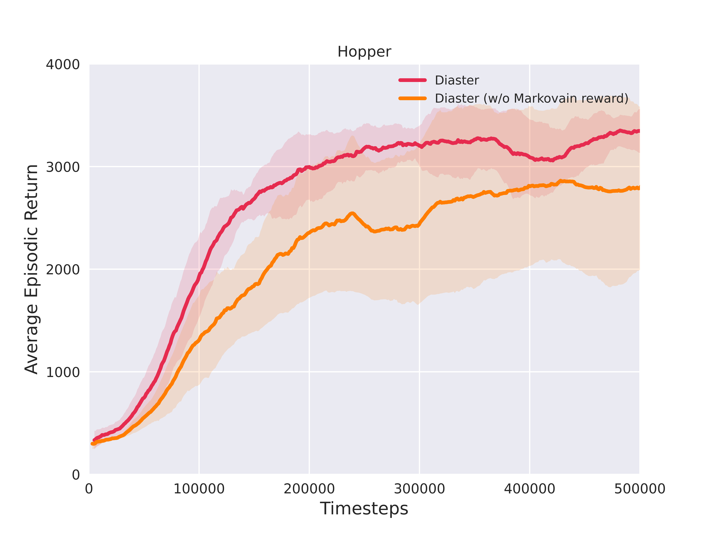
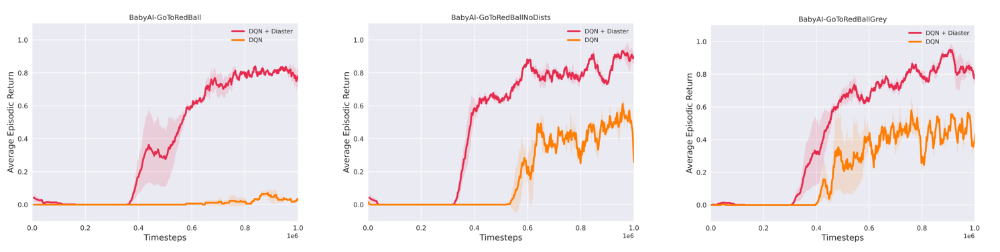
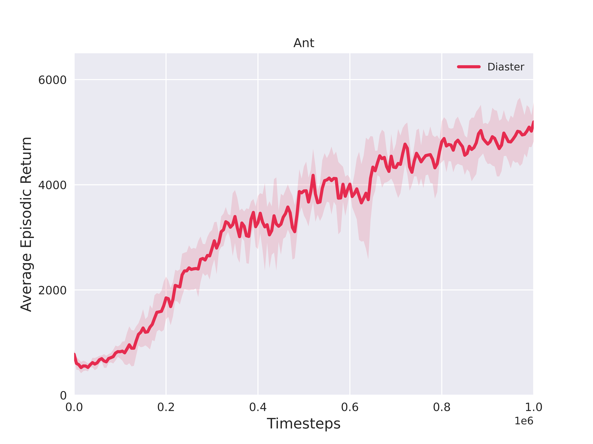
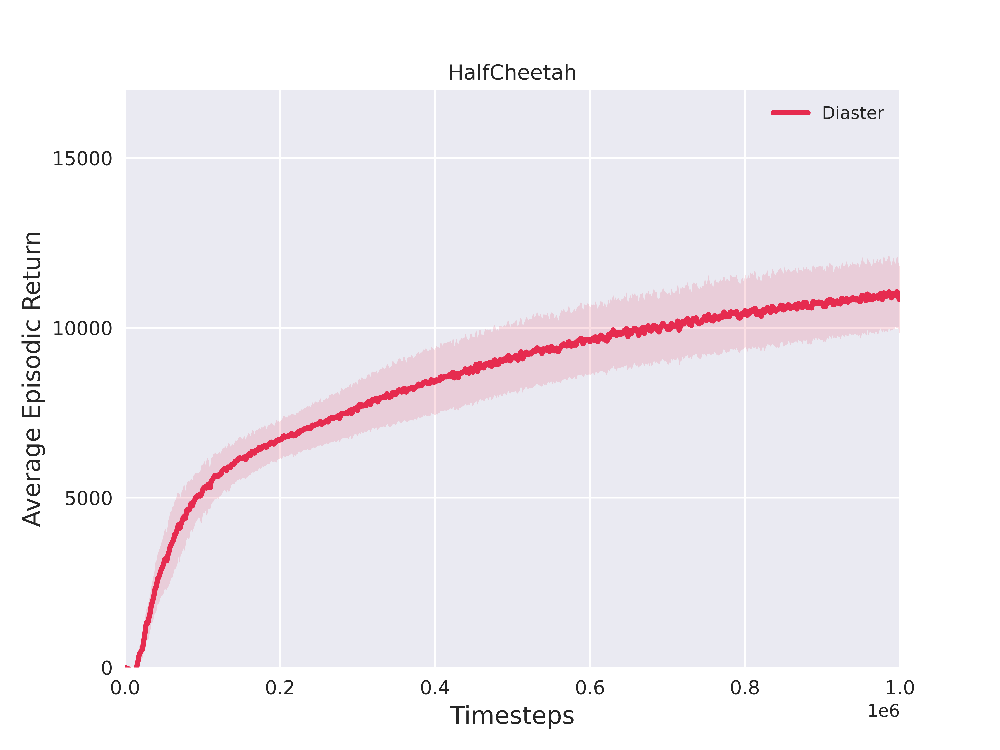

---

---

# Supplementary Experiments

### 1. Distribution of step-wise proxy reward $\hat{r}(s_t,a_t)$ over time step $t\in[0, T-1]$

 

We train RUDDER and Diaster on Hopper respectively. After training, we use the optimized policy to sample some trajectories and record the learned step-wise proxy reward at each time step $t\in[0, T-1]$. The Distribution of step-wise proxy reward over time step is shown in the above figure. It can be found that the step-wise proxy reward learned by RUDDER is mainly concentrated in the front of the trajectory and sparse in the back. The problem comes from the lack of attribution capacity since RUDDER doesn't assign the episodic reward to different parts of the trajectory. 

We point out that appropriately assigning the total return to different parts of the sequence while retaining the capacity of representing the episodic reward function is important.

### 2. Reward Visualization

We add the points (orange) of the unobservable ground-truth rewards for reference.

### 3. Ablation on whether learning Markovian step-wise reward function

The performance of Diaster with and without learning a Markovian step-wise reward function is shown in the above figure. If without the Markovian reward function, the variance of the learning process would become greater, due to the non-stationarity.

### 4. Performance evaluation on MiniGrid benchmark

We compare DQN + Diaster and DQN on several MiniGrid-BabyAI environments (visual input, discrete control, episodic reward setting).

### 5. Performance evaluation on Ant and Half-cheetah

